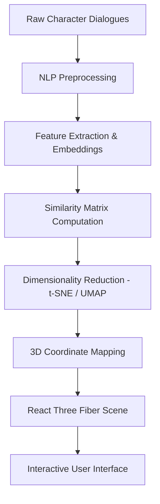

<div align="center">

# 🌌 Harry Potter Character Galaxy

### AI-Powered NLP & 3D Character Similarity Visualization

[](https://vercel.com)
[](https://fastapi.tiangolo.com)
[](https://reactjs.org)
[](https://threejs.org)
[](https://python.org)

<br/>

*A high-dimensional journey through character relationships, mapped by NLP neural networks and visualized in a living 3D star-field.*

</div>

---

## 📸 Screenshots

### 🏠 Landing Page

> *"Unveil the Wizarding Galaxy" — AI-Powered Wizarding Analytics home screen*

### 🌌 Galaxy Explorer

> *150+ characters analyzed · Gryffindor (red) & Slytherin (green) clusters · Interactive 3D navigation*

### 🧠 Neural Profile Panel

> *Semantic proximity scores, trait analysis (Power / Loyalty / Empathy), and TextBlob dialogue sentiment per character*

---

## ✨ Project Overview

**Harry Potter Character Galaxy** is an immersive, AI-driven visualization platform that explores the intricate web of relationships in the wizarding world. By analyzing thousands of lines of character dialogues using state-of-the-art **Natural Language Processing (NLP)**, the system maps characters into a dynamic 3D star-field where spatial distance represents semantic and emotional similarity.

> *"Words are, in my not-so-humble opinion, our most inexhaustible source of magic."*
> — **Albus Dumbledore**

---

## 🚀 Key Features

- 🌌 **Interactive 3D Galaxy** — Explore a living universe where characters are represented as glowing celestial nodes. Similar speaking styles and emotional arcs result in closer spatial proximity.
- 🧠 **Advanced NLP Engine** — Deep analysis of vocabulary usage, sentence structure, and dialogue patterns using **Sentence Transformers** and **OpenAI/Groq Embeddings**.
- 🎭 **Emotion & Trait Mapping** — Characters are profiled based on core traits: **Power**, **Loyalty**, and **Empathy**.
- 🔍 **Real-Time Neural Search** — Instantly locate any wizard or witch and see their nearest neighbors in the vector space.
- 🛡️ **House-Based Clustering** — Visual grouping of characters by Hogwarts Houses powered by AI-driven semantic similarity.
- 💬 **Dialogue Sentiment Analysis** — TextBlob polarity scoring per character, from Neutral/Balanced to strongly charged speech.

---

## 🛠️ Tech Stack

### Frontend
| Tech | Purpose |
|------|---------|
| **React.js + Vite** | Modern, high-performance web framework |
| **Three.js / React Three Fiber** | Immersive 3D graphics and animations |
| **Tailwind CSS 4** | Premium utility-first styling with custom magical theme |
| **Framer Motion** | Cinematic UI transitions and micro-animations |

### Backend
| Tech | Purpose |
|------|---------|
| **FastAPI** | Ultra-fast Python web framework for character intelligence |
| **Scikit-learn** | Dimensionality reduction (t-SNE / UMAP) and clustering |
| **Sentence Transformers** | Convert raw dialogue into high-dimensional vectors |
| **TextBlob** | Dialogue sentiment polarity analysis |

---

## 📂 System Architecture



---

## 📖 Methodology

The project follows a rigorous NLP pipeline:

1. **Dialogue Aggregation** — Consolidating dialogue from scripts and books into a unified corpus.
2. **NLP Preprocessing** — Tokenization, stop-word removal, and linguistic feature extraction.
3. **Neural Encoding** — Converting text into **1536-dimensional vectors** using Sentence Transformers.
4. **Similarity Matrix** — Computing cosine similarity across all character embeddings.
5. **Spatial Reduction** — Using UMAP / t-SNE to compress 1536D into 3D coordinates.
6. **Visual Rendering** — Rendering coordinates into a real-time interactive Three.js scene.

---

## 📥 Installation & Setup

### Prerequisites
- Node.js `v18+`
- Python `3.10+`
- Git

### 1. Clone the Repository
```bash
git clone https://github.com/khushalkks/Harry_Porter.git
cd Harry_Porter
```

### 2. Frontend Setup
```bash
cd frontend
npm install
npm run dev
```

### 3. Backend Setup
```bash
cd ../backend
pip install -r requirements.txt
python app/main.py
```

---

## 📁 Project Structure

```
Harry_Porter/
├── frontend/
│   ├── src/
│   │   ├── components/      # React components
│   │   ├── scenes/          # Three.js 3D scenes
│   │   └── pages/           # Core, Explorer, Archive
│   └── package.json
├── backend/
│   ├── app/
│   │   ├── main.py          # FastAPI entry point
│   │   ├── nlp/             # NLP pipeline
│   │   └── data/            # Character dialogue data
│   └── requirements.txt
└── README.md
```

---

## 📜 License

Distributed under the **MIT License**. See `LICENSE` for more information.

---

<div align="center">

**Developed with ⚡ and Magic for the Wizarding World**

*[khushalkks](https://github.com/khushalkks)*

</div>
